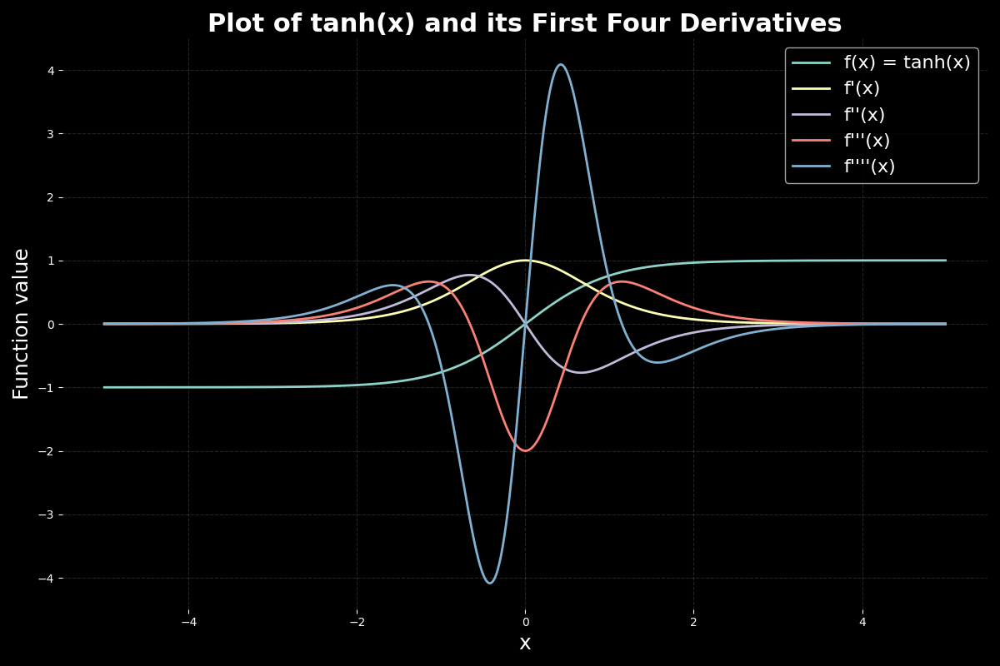

# MicroJAX

<p align="center">
  
</p>

`python tanh.py`

Microjax is function transformation engine like JAX or MLX,<br>
it’s got forward mode and reverse mode automatic differentiation support!, and support for nested structures (PyTrees). 🌳

## 🗂️ What's Inside?

- **`microjax.py`**: The magic of auto-diff happens here.  🪄
- **`pytree.py`**:  🌳 Flatten and unflatten those nested data structures
- **`nn.py`**: Build a simple neural net and watch it learn XOR! 🧠
- **`tanh.py`**: Visualize the `tanh` function and its first four derivatives. 📈

## 🚀 Quick Start
```python
from microjax import grad

def f(x):
    return x*x+2*x+3
print(f"f(3.0) = {f(3.0)}")
print(f"f'(3.0) = {grad(f)(3.0)}")
```

```bash
❯ python dev.py
f(3.0) = 18.0
f'(3.0) = 8.0

```
<br>

Look into microjax.py 


```bash
❯ python microjax.py
## Forward Mode Automatic Differentiation (JVP) ##
f(x) = 118.87663200000001
f'(x) = 103.2964
f''(x) = 60.519999999999996
f'''(x) = 18.0
------------------------------------------------------------------------------

## Reverse Mode Automatic Differentiation (VJP) ##
f(x) = 118.87663200000001
f'(x) = 103.2964
f''(x) = 60.519999999999996
f'''(x) = 18
------------------------------------------------------------------------------ 

## Composition of Forward and Backward ##
Forward on Backward 60.519999999999996
Backward on Forward 60.519999999999996

------------------------------------------------------------------------------

## pytree.py ##
{'hi': 0.01493120808257803, 'there': [1.0, 0.0]}

------------------------------------------------------------------------------
MicroJAX:  0.01493120808257803
JAX:  0.014931838
```

## 📜 License

MIT License.

---
[](https://ko-fi.com/R6R8KQTZ5)